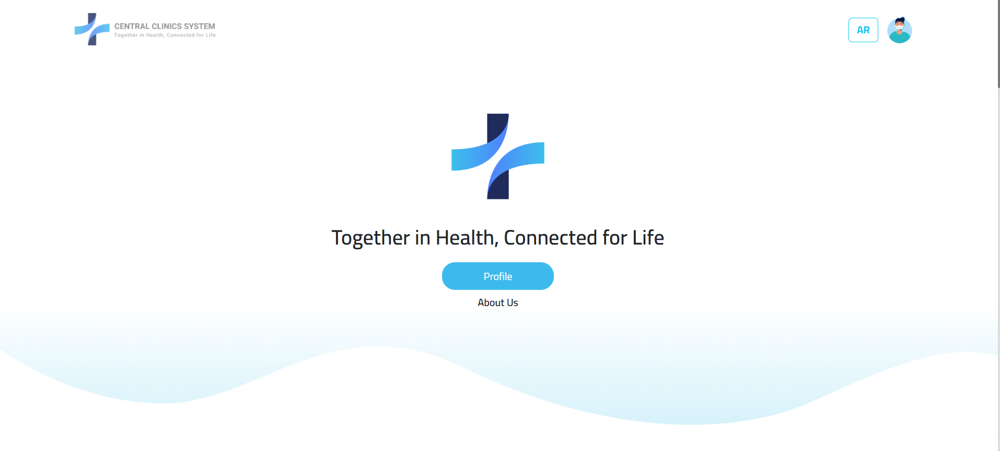

# 🏥 Central Clinics Management System  

The **Central Clinics Management System (CCMS)** is a full-stack healthcare management platform designed to streamline **patient records, appointments, pharmacy operations, and clinical workflows**.  
It connects multiple departments (clinics, doctors, pharmacies, and patients) into one unified system with **role-based access**.  

---

## ✨ Features  

### 👨‍💼 Admin  
- Secure login/logout using email & password  
- Manage personal account (update info, change password)  
- Manage clinic departments (view, add, edit, delete)  
- Manage clinics (view, add, edit, delete, assign departments)  
- Manage doctors (view, add, edit, delete, assign permissions)  
- Manage patients (view, add, edit, delete, view details)  
- Manage patient records (medical reports, diagnoses)  
- Manage transfer requests (view, update status, delete)  
- Manage patient appointments (view, add, edit, delete)  
- Manage pharmacies (view, add, edit, delete, manage medications)  

### 🏢 Clinic Owner  
- Login/logout using **owner number** & password  
- Manage personal account (update info, change password)  
- Manage doctors (view, add, edit, assign permissions)  
- Manage appointments (view, update status)  

### 👨‍⚕️ Doctor  
- Login/logout using **job number** & password  
- Manage personal account (update info, change password)  
- Manage patients (add, view details)  
- Manage patient records (add, edit medical reports/diagnoses, depending on permissions)  
- Manage transfer requests (add, view details)  
- Manage appointments (view, add, edit status)  

### 💊 Pharmacy Doctor  
- Login/logout using **pharmacy number** & password  
- Manage personal account (update info, change password)  
- Dispense medications or provide substitutes to patients  

### 🧑‍🤝‍🧑 Patients  
- Login/logout using **civil ID** & password  
- Manage personal account (update info, change password)  
- Manage appointments (view, book new)  
- View medical records, reports, and diagnoses  
- View prescribed medications and details  

---

## 🛠️ Tech Stack  

- **Backend:** PHP (Laravel)  
- **Frontend:** JavaScript, Bootstrap, jQuery  
- **Database:** MySQL  
- **Version Control:** Git  
- **IDE/Tools:** VS Code, Laragon  

---

## 📸 Screenshots  

  


---

## 🚀 Installation & Setup  

1. **Clone the repository**  
   ```bash
   git clone https://github.com/yourusername/central-clinic-management.git
   cd central-clinic-management
---

2. **Set up environment**

   * Install [Laragon](https://laragon.org/) or [XAMPP](https://www.apachefriends.org/).
   * Place the project folder in `www` or `htdocs`.

3. **Database setup**

   * Create a new MySQL database (e.g., `ccms_db`).
   * Import the included SQL file (`ccms_db.sql`).
   * Update `.env` file with database credentials.

4. **Run migrations & seed (if applicable)**

   ```bash
   php artisan migrate --seed
   ```

5. **Start server**

   ```bash
   php artisan serve
   ```

   Open [http://localhost:8000](http://localhost:8000).

---

## 🎮 Usage

* **Admin:** Full system control (departments, clinics, doctors, patients, pharmacy, appointments).
* **Clinic Owner:** Manage their clinic, doctors, and appointments.
* **Doctor:** Manage patients, medical reports, and appointments.
* **Pharmacy Doctor:** Dispense medications.
* **Patients:** Book appointments, view medical history & medications.

---

## 🔮 Future Improvements

* 📩 Add email & SMS notifications for appointments.
* 📊 Generate analytics dashboards for admins.
* 📱 Develop a mobile-friendly version using Flutter.
* 🔒 Enhance security with 2FA (two-factor authentication).

---

## 🤝 Contributing

Contributions are welcome!

1. Fork the repository
2. Create a new branch (`feature/your-feature`)
3. Commit your changes
4. Open a Pull Request

---

## 📜 License

This project is licensed under the **MIT License** – feel free to use and modify it.

---

## 👤 Author

**Osama Fattoum**
